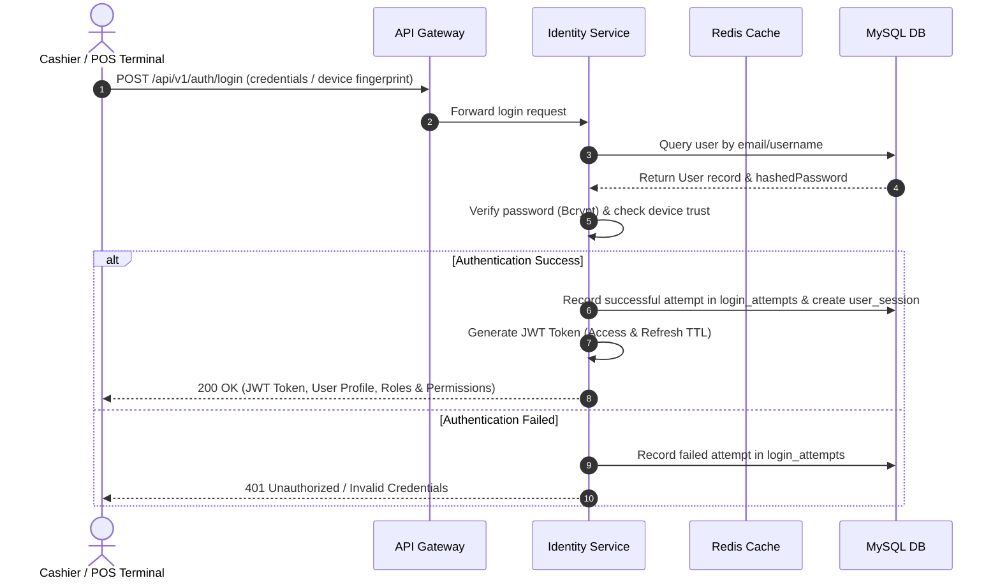
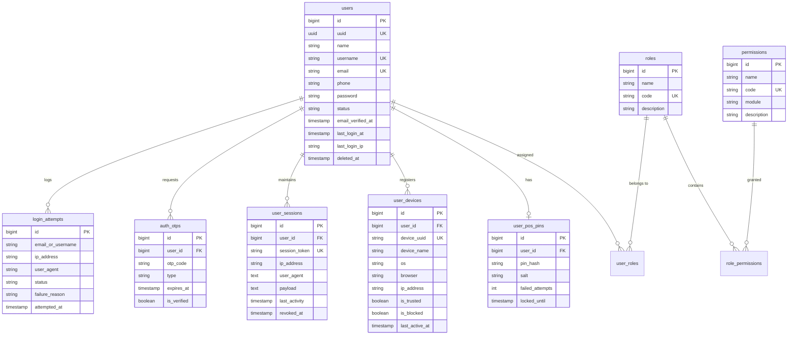
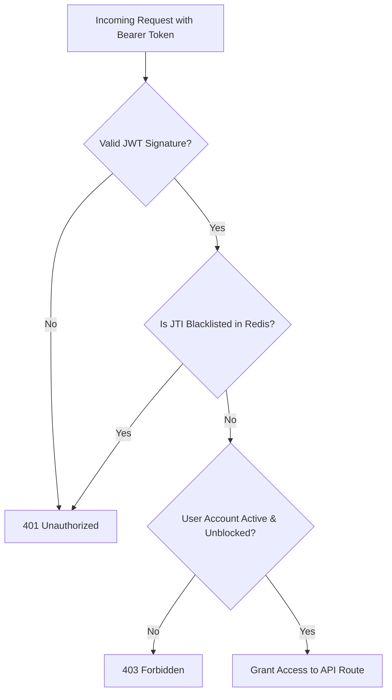
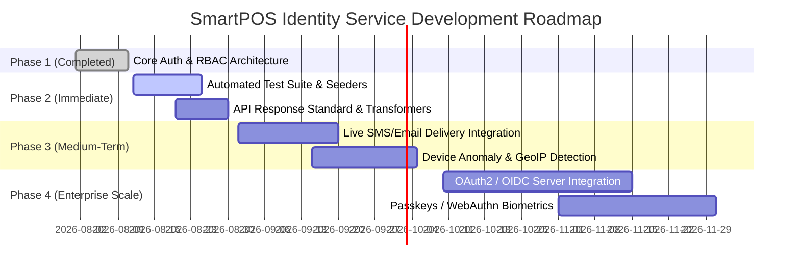

# SmartPOS Identity Service — System Architecture & Design Document

> **Document Version:** 1.0.0  
> **Last Updated:** August 2026  
> **Service Name:** `smartpos/identity-service`  
> **Repository:** SmartPOS Platform Ecosystem  

---

## 1. Executive Summary & System Overview

**SmartPOS Identity Service** (`smartpos/identity-service`) is the foundational identity provider (IdP), authentication engine, and access control microservice for the SmartPOS retail and point-of-sale ecosystem.

It provides centralized user management, JWT token-based authentication, fine-grained Role-Based Access Control (RBAC), cashier POS PIN security, device trust management, user session revocation, and security audit logging.

```
                    +-------------------------------------------------+
                    |                SmartPOS Clients                 |
                    |   (Mobile POS, Web Admin, Terminal Hardware)    |
                    +------------------------+------------------------+
                                             | HTTP / REST (v1)
                                             v
                    +-------------------------------------------------+
                    |              API Gateway / Ingress              |
                    +------------------------+------------------------+
                                             |
                                             v
                    +-------------------------------------------------+
                    |      SmartPOS Identity Service (Laravel 12)     |
                    |   +-----------------------------------------+   |
                    |   |  JWT Auth Guard & Security Middleware   |   |
                    |   +-----------------------------------------+   |
                    |   |  RBAC (Users, Roles, Permissions)       |   |
                    |   +-----------------------------------------+   |
                    |   |  POS Quick-PIN & Device Trust Engine    |   |
                    |   +-----------------------------------------+   |
                    +------------+-----------------------+------------+
                                 |                       |
                                 v                       v
                    +------------------------+ +----------------------+
                    |  MySQL 8.4 (Data Store)| | Redis 8 (Token/Cache)|
                    +------------------------+ +----------------------+
```

---

## 2. High-Level System Architecture

### 2.1 Technology Stack

| Layer | Component | Technology / Library |
| :--- | :--- | :--- |
| **Runtime Environment** | Language & Engine | PHP 8.3+ |
| **Framework** | Web Framework | Laravel 12.x / 13.x |
| **Authentication** | Token Engine | `php-open-source-saver/jwt-auth` v2.9 |
| **API Documentation** | OpenAPI Generator | Dedoc Scramble (`/docs/api`) |
| **Primary Relational DB** | Storage & Persistence | MySQL 8.4 (InnoDB, UTF8mb4) |
| **Caching & Session DB** | Cache & Token Blacklist | Redis 8 |
| **Containerization** | Infrastructure | Docker & Docker Compose |

---

### 2.2 System Context & Request Execution Flow



---

## 3. Database Architecture & Data Schema

The database design relies on 13 migrations that enforce relational integrity, index efficiency, and security isolation.



---

## 4. Security Architecture & Threat Defense

### 4.1 Token Lifecycle & Revocation
- **JWT Standard Claims:** Issued with `sub` (User ID), `iat`, `exp`, `nbf`, and `jti` (unique JWT ID).
- **Blacklisting via Redis:** Upon explicit logout (`POST /api/v1/auth/logout`) or session termination, the token JTI is pushed to Redis with an expiration matching the token's remaining TTL.



### 4.2 POS Terminal Quick-PIN Security
- **Salted Hashing:** Fast cashier authentication on POS hardware relies on a 4-6 digit numeric PIN.
- **Lockout Mechanism:** After consecutive failed PIN attempts, `failed_attempts` increments. Crossing the threshold triggers a lock on `locked_until` to block brute-force attacks on POS terminals.

### 4.3 3-Step OTP Password Reset Workflow
1. **Send OTP Code (`POST /api/v1/auth/forgot-password/send-code`):** Generates a cryptographically random 6-digit numeric OTP with 15-minute expiration stored in `auth_otps`.
2. **Verify Code (`POST /api/v1/auth/verify-reset-code`):** Validates the active OTP, setting `is_verified = true`.
3. **Reset Password (`POST /api/v1/auth/reset-password`):** Consumes the verified OTP token to update the user password with Bcrypt hashing.

### 4.4 Middleware Security Pipeline

```
Route Request
     │
     ▼
[ Throttle Middleware ] ---> Rate limit login/register attempts (e.g. 5 req/min)
     │
     ▼
[ Auth Guard (auth:api) ] -> Validates JWT bearer token & extracts User
     │
     ▼
[ Permission / Role Middleware ] -> CheckPermission.php & CheckRole.php
     │
     ▼
[ Controller Execution ] -> Business Logic Execution
```

---

## 5. API Module Summary

All endpoints are hosted under prefix `/api/v1`.

| Module | Sub-Module | Key Capabilities |
| :--- | :--- | :--- |
| **Auth** | Authentication | Login, Registration, JWT Refresh, Token Blacklist Logout, Profile (`/auth/me`). |
| **Auth** | Password Recovery | OTP Generation, OTP Code Verification, Password Reset. |
| **Users** | User Management | Admin CRUD operations for user accounts with soft deletion support. |
| **RBAC** | Roles & Permissions | Dynamic Role definition, Permission creation, Role-Permission sync. |
| **RBAC** | User Roles | Assigning or revoking roles to users (`/users/{user}/roles`). |
| **Terminal** | POS PIN | Fast PIN creation, updates, and terminal cashier validation (`/users/{user}/pos-pin/verify`). |
| **Security** | Device Trust | Register devices, set trusted flag (`is_trusted`), block device (`is_blocked`). |
| **Security** | Sessions | Active user session tracking, single session revoke, purge all active sessions. |
| **Audit** | Audit Logs | Complete login attempt tracking (`success`/`failed` with IP & User-Agent). |

---

## 6. Containerization & Deployment Architecture

The application is fully containerized using Docker & Docker Compose:

```
                          +-----------------------------------+
                          |        Docker Container Network   |
                          |        (smartpos-identity-net)     |
                          +-----------------+-----------------+
                                            |
        +-----------------------------------+-----------------------------------+
        |                                   |                                   |
        v                                   v                                   v
+---------------+                   +---------------+                   +---------------+
|   app (PHP)   |                   |  db (MySQL)   |                   | redis (Cache) |
| Port: 8001    |                   | Port: 3307    |                   | Port: 6380    |
+---------------+                   +---------------+                   +---------------+
        |                                   |
        +------------------+----------------+
                           |
                           v
                   +---------------+
                   |  phpMyAdmin   |
                   | Port: 8081    |
                   +---------------+
```

### Container Services Configuration:
- **`app`**: Custom PHP 8.3 FPM / Nginx image hosting Laravel 12 application code.
- **`db`**: Official MySQL 8.4 container with persistent storage volumes.
- **`redis`**: Official Redis 8 container configured for volatile-lru caching and queue backend.
- **`phpmyadmin`**: Database management UI exposed for localized developer debugging.

---

## 7. Task Progress & Development Roadmap

### 7.1 ✅ Completed Milestones

- [x] **Database Schema Foundation:** Built 13 robust migrations covering users, roles, permissions, devices, sessions, POS PINs, and login attempts.
- [x] **Authentication Engine:** Complete JWT authentication flow using `jwt-auth`, including registration, login, token refresh, and logout.
- [x] **Password Recovery System:** 3-step OTP-based password reset workflow (`send-code`, `verify-code`, `reset-password`).
- [x] **Full RBAC System:** Implemented dynamic Roles & Permissions, including mapping models and middleware (`CheckPermission` & `CheckRole`).
- [x] **POS Terminal PIN Engine:** Hashed PIN registration, update, and quick-verify endpoint for cashier POS terminals.
- [x] **Device Trust & Session Management:** Device tracking, trusted/blocked status management, and remote session revocation APIs.
- [x] **Multi-Container Infrastructure:** Complete Docker Compose deployment setup with MySQL 8.4, Redis 8, and phpMyAdmin integration.
- [x] **API Auto-Documentation:** Scramble OpenAPI documentation integrated at `/docs/api`.

---

### 7.2 📋 Actionable Roadmap & Priority Backlog



#### Phase 2: Quality Assurance, Testing & Seeders (Target: Q3 2026)
- [x] **Redis RBAC Caching Engine:** Low-latency caching of user permissions and roles using Redis with smart cache invalidation on role updates.
- [ ] **Gmail SMTP Mailer Integration:**
  - Configure Gmail / SMTP driver for real email delivery of 6-digit OTP password reset codes in `ForgotPasswordController.php`.
- [ ] **Telegram Bot OTP Dispatch (by Phone Number):**
  - Implement Telegram Bot API integration to dispatch 6-digit OTP verification codes directly to cashier/user mobile phones via Telegram webhook/bot notification.
- [ ] **Automated Feature Test Suite:**
  - Create `AuthControllerTest.php` to verify login, refresh, profile, registration, and logout flows.
  - Create `RbacTest.php` to verify role assignment, permission checks, and 403 authorization rejections.
  - Create `UserPosPinTest.php` to verify PIN validation, lockout counters, and updates.
- [ ] **Baseline Database Seeders:**
  - Create `RoleAndPermissionSeeder` with standard POS roles (`Admin`, `Store_Manager`, `Cashier`, `Inventory_Clerk`).
  - Create default permission mapping matrix (`users.manage`, `roles.manage`, `pos_pin.manage`, `devices.manage`).
- [ ] **API Response Standardization:**
  - Implement unified API Resources (`UserResource`, `RoleResource`, `UserDeviceResource`).
  - Implement a global `ApiResponse` trait for consistent `{ success: bool, data: [...], message: string }` payloads.

#### Phase 3: Production Hardening & Integration (Target: Q4 2026)
- [ ] **Security Anomaly Detection:**
  - Implement GeoIP lookup on `login_attempts` to flag logins from unexpected countries or unusual IP ranges.
  - Automatically notify users upon login from an untrusted or new device.

#### Phase 4: Enterprise Scale & Ecosystem Federation (Target: Late 2026 / 2027)
- [ ] **OAuth2 / OpenID Connect (OIDC) Provider:**
  - Integrate Laravel Passport or Sanctum OIDC extension to enable single sign-on (SSO) across 3rd party SmartPOS extensions.
- [ ] **Biometric & WebAuthn Integration:**
  - Enable hardware key (FIDO2) and biometric login capabilities for desktop and tablet POS hardware.
- [ ] **High Availability & Distributed Caching:**
  - Deploy Redis Sentinel / Cluster configuration for zero-downtime token revocation checks across multiple regions.
